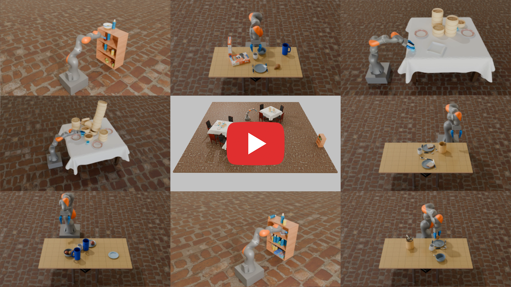
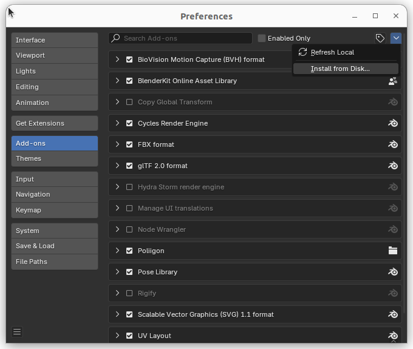
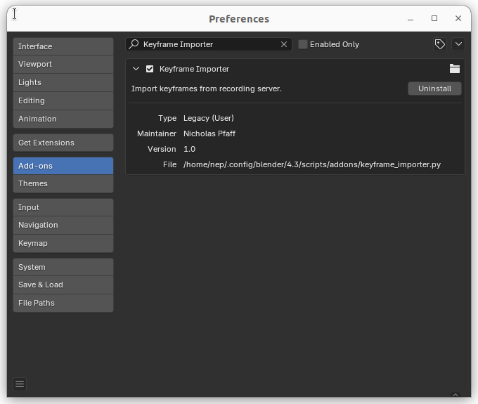
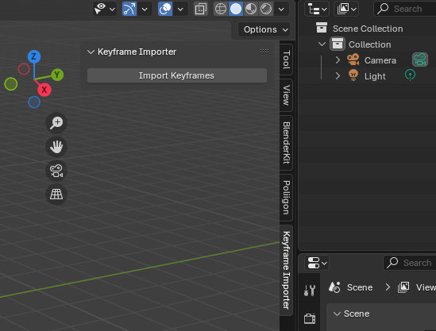
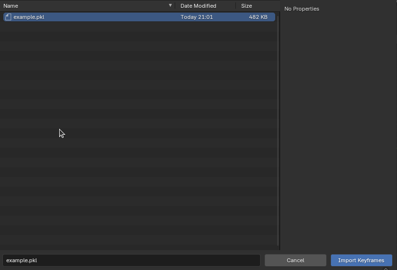
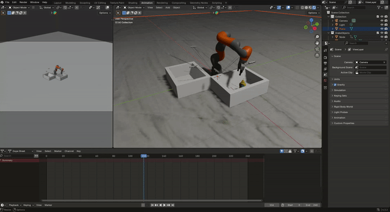

# drake-blender-recorder
Tools for replaying Drake simulations in Blender.

Allows you to easily record Drake simulations and import them into Blender for
visualization. The Blender scenes are animated using keyframes.

Note that part of the code is based of
[Drake Blender](https://github.com/RobotLocomotion/drake-blender).
This work was inspired by
[pybullet-blender-recorder](https://github.com/huy-ha/pybullet-blender-recorder).

Below is an example video from
[Steerable Scene Generation](https://steerable-scene-generation.github.io/) that was
enabled by Drake Blender Recorder. All individual clips from that video were created
by first simulating in Drake, exporting into Blender using Drake Blender Recorder, and
then rendering with Blender.

<a href="https://youtu.be/oh9RajpEjKw">
  
</a>

# Setup

## Installing the Blender Plugin

Open up Blender, go to Edit > Preferences > Add-ons. Then click on the down arrow in
the top right corner and select "Install from Disk...".



Navigate to and import `keyframe_importer.py`. Make sure that the newly added
"Keyframe Importer" addon is enabled.



You should see a "Keyframe Importer" entry in the sidebar.



You can use this GUI to import a recording `.pkl` file.

## Installing the Dependencies

This repo uses Poetry for dependency management. To setup this project, first install
[Poetry](https://python-poetry.org/docs/#installation) and, make sure to have Python3.10
installed on your system.

Then, configure poetry to setup a virtual environment within the project directory:
```bash
poetry config virtualenvs.in-project true
```

Next, install all the required dependencies to the virtual environment with the
following command:
```bash
poetry install
```

## Recording a Drake Simulation

First, start the recording server:

```bash
python drake_recording_server.py \
    --export_path example_output/example.blend \
    --keyframe_dump_path example_output/example.pkl \
    --blend_file example_output/example_start.blend
```
Note that you need to re-start the server whenever you want to start a new recording.
You might want to start with a pre-defined Blender scene that the Drake objects should
be added to using the `--blend_file` flag.

Then run your simulation as usual. Note that every render request from a Blender camera
will trigger the recording of a new keyframe.

The example simulation script shows how to set up such a Blender camera and can be run
as follows:

```bash
python example_sim.py
```

The example is a simple iiwa teleop. It will open up a Meshcat window that can be used
for controlling the iiwa arm. Note that the teleop is rather difficult as the simulation
runs below real time rate due to the constant keyframe logging.

## Importing a Recording into Blender

First open the Blender file that was exported from the recording server. In our case,
this is `example_output/example.blend`.

Then, use the "Keyframe Importer" addon to import the recording. In our case, this is
`example_output/example.pkl`.



You can now play back the animation in Blender.



We provide pre-recorded example files in `example_output/` for testing.

The final render might look something like this (I had to decrease quality for the gif):


I hope you create a better looking scene than this!
